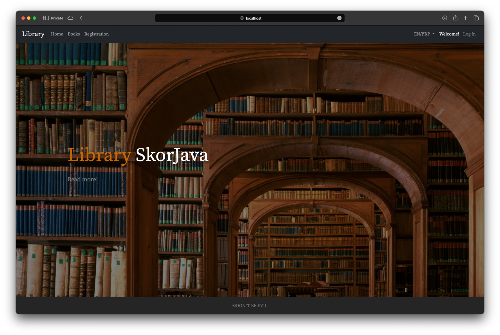

# Library

## Description

My application context is used in this project. There is no Spring in this project. The following technologies are used:
- Java 20 (+Virtual Threads)
- JDBC
- PostgreSQL
- JSP
- JSTL
- HTML
- CSS
- Bootstrap 5
- Maven
- Tomcat 11

The reader registers in the system and then can:
- search (by author (s) / title / description / ISBN / keywords) and view books from the catalog;
- place an order for a Book from the Catalog.
  A non-registered reader cannot order a book.
  
For the catalog the ability to sort books is implemented:
- by name;
- by author (s);
- by ISBN;
- by date of publication.
  
The librarian gives the reader a book on a subscription or to the reading room. 
The book is issued to the reader for a certain period. If the book is not returned within the specified period, 
the reader will be fined. The book may be present in the library in one or more copies. 
The system keeps track of the available number of books. 
Each user has a personal account that displays registration information

And also:
1) for reader:
- list of books on the subscription and date of possible return (if the date is overdue, the amount of the fine is displayed);
2) for librarian:
- list of readers' orders;
- list of readers and their subscriptions.
3) the system administrator has the rights:
- adding / deleting a book, editing information about the book;
- change user`s roles;
- blocking / unblocking the user.

## How to run

Before you run the application please make sure to execute the SQL script from the `src/main/resources/schema.sql` file.
The script will create the database and the necessary tables. 
Then you have to execute the SQL script from the `src/main/resources/data.sql` file. 
The script will insert some data into the database.

1. Clone the repository
2. Open the project in your IDE
3. Run the project (it will bootstrap all the necessary classes and start the server on port 8080)
4. Open the browser and go to http://localhost:8080
5. Enjoy!

## How to use

1. Register a new user
2. Log in
3. Enjoy!
